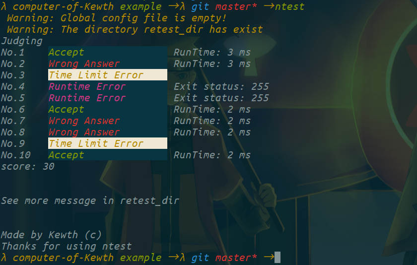

## 安装

请自行安装 `python3-pip` 。

注意，请确保 `~/.local/bin` 在环境变量中，否则请在 `.bashrc` （或者其他启动脚本）的最后中添加一行：

`export PATH="$HOME/.local/bin:$PATH"`

不要尝试去掉 `--user` 选项而加上 `sudo` 。

### 直接安装

方便，但是不会经常维护，如果碰到问题请使用源码安装获得最新版本。

```
pip3 install oiretest --user
```

### 从源码安装

直接安装最新的稳定版本。

```bash
git clone https://github.com/kewth/retest
cd retest
pip3 install . --user
```

## 使用

请自行查看帮助：

```bash
retest -h
```

或者

```bash
retest -l
```

## 说明

- 单人评测脚本。
- 专为偏爱终端的 OIer 设计，方便在改题的时候随时重测自己的程序，或者进行对拍。
- 同样适用于出题时，用自己造的数据测试标程或部分分程序的正确性。

## 功能/特性

- 支持 AC, WA, RE, TLE, MLE, CE 评测状态（目前对 MLE 的判定不佳，可能会显示为 RE ）。
- 支持 spj 比较（ spj 格式兼容 lemon ）。
- 支持对拍。
- 支持自定义以及内置插件扩展。
- 每个点 AC 后会给出用时。
- 评测后会生成目录 retest_dir ，内有评测详细信息，用于快速找错调试。
- 对于数据按规模大小排序，出错时方便找到规模最小的数据进行调试。

## 本地化

由于每个人使用习惯不相同， retest 不会去刻意迎合某个习惯。  
但是想让 retest 在自己的习惯下更好用，也是很容易做到的。  
比如写个 retest.yaml 生成器之类的小工具，或者使用 python 编写扩展插件得到更好的效果，甚至可以用 retest 做后端自己写接口。

如果你有自己的小工具或者插件，不妨写在 extra 目录下或者 plugin 目录下，提交 pull request 。

## 常见问题

Q: 为什么 retest 测第 3 个点 WA 但是自己测的时候 AC ？  
A1: 第三个点 3.in 在实际数据文件夹中可能并不是 3.in ，事实上 3.in 指的是 retest_dir/3.in 。  
A2: 程序里有 freopen 但未指定 input/output

Q: 那 retest 测第 3 个点 WA 了要如何找到对应数据，或者说如何对于第 3 个点进行调试？  
A: retest_dir/3.in 是输入数据，retest_dir/3.ans 是标准输出，retest_dir/3.out 是你的答案，retest_dir/res3 给出了一些其他信息。

Q: 为什么改 retest_dir 里面的数据的时候原数据也出了问题。  
A: retest_dir 内的数据实际上都是符号链接。

Q: 为什么 retest 报错并崩溃？  
A: 一种可能是写了 input/output 但没打 freopen 。

